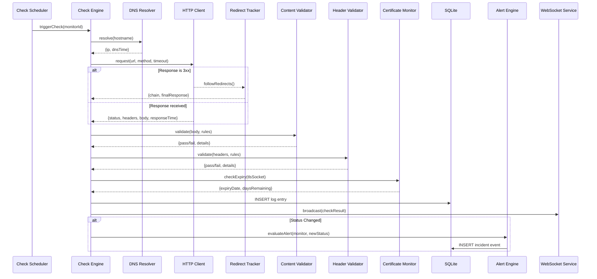

# Design Document: Advanced Monitoring Suite

## Overview

The Advanced Monitoring Suite extends RxMonitor's existing Express + SQLite architecture with five major capability areas: HTTP Deep Checks, Performance & Load Testing, Alerting & Incidents, Logs & Diagnostics, and Dashboard & Visualization. The design preserves the current single-process Node.js architecture and SQLite storage model, adding new modules alongside the existing `monitor.js`, `notifier.js`, and `database.js` files.

### Design Principles

- **Modular extension**: Each capability area is implemented as a separate module, imported by `server.js`
- **SQLite-first**: All persistent state uses SQLite with new tables and indexes
- **Backward compatible**: Existing API contracts and database schema remain unchanged
- **Progressive enhancement**: Features degrade gracefully (e.g., traceroute unavailable, headless browser missing)
- **Real-time optional**: WebSocket layer supplements but does not replace the REST API

### Key Technical Decisions

| Decision | Rationale |
|----------|-----------|
| Keep SQLite (no migration to Postgres) | Simplicity; single-file deployment; adequate for monitoring workloads with proper indexing |
| Use `ws` library for WebSocket | Lightweight, well-maintained, integrates directly with Express HTTP server |
| Use `puppeteer-core` for screenshots | Allows using system-installed Chromium; avoids bundling a full browser |
| Use Node.js `child_process` for traceroute | Platform-native traceroute provides accurate network path data |
| Implement geographic checks via configurable HTTP proxy endpoints | Avoids requiring separate deployed agents; uses existing infrastructure |
| Store screenshots on filesystem, metadata in SQLite | Binary blobs don't belong in SQLite; filesystem is simpler than S3 for self-hosted |


## Architecture

### System Architecture Diagram

```mermaid
graph TB
    subgraph "Client Layer"
        Browser["Browser (Static HTML/JS)"]
        WSClient["WebSocket Client"]
    end

    subgraph "Server Layer (Node.js/Express)"
        API["REST API (server.js)"]
        WS["WebSocket Service (ws-service.js)"]
        
        subgraph "Check Engine"
            Monitor["monitor.js (existing)"]
            Synthetic["synthetic.js"]
            ContentVal["content-validator.js"]
            HeaderVal["header-validator.js"]
            CertMon["certificate-monitor.js"]
            DNSRes["dns-resolver.js"]
            RedirectTrack["redirect-tracker.js"]
        end

        subgraph "Performance Engine"
            Percentile["percentile-calculator.js"]
            Apdex["apdex-calculator.js"]
            LoadTest["load-tester.js"]
            ConnDetect["connection-detector.js"]
            GeoCheck["geographic-checker.js"]
        end

        subgraph "Alert Engine"
            Escalation["escalation-engine.js"]
            Maintenance["maintenance-window.js"]
            Timeline["incident-timeline.js"]
            StatusPage["status-page-manager.js"]
            Dedup["alert-deduplicator.js"]
            OnCall["on-call-scheduler.js"]
            Notifier["notifier.js (extended)"]
        end

        subgraph "Diagnostics Engine"
            LogIngest["log-ingestion.js"]
            ErrorRate["error-rate-tracker.js"]
            Traceroute["traceroute-runner.js"]
            Screenshot["screenshot-capture.js"]
            DiffDetect["diff-detector.js"]
        end
    end

    subgraph "Storage Layer"
        SQLite["SQLite (monitor.db)"]
        FS["Filesystem (screenshots/)"]
    end

    Browser --> API
    WSClient --> WS
    API --> Monitor
    API --> Synthetic
    Monitor --> ContentVal
    Monitor --> HeaderVal
    Monitor --> CertMon
    Monitor --> DNSRes
    Monitor --> RedirectTrack
    Monitor --> WS
    API --> Percentile
    API --> Apdex
    API --> LoadTest
    API --> ConnDetect
    API --> GeoCheck
    Monitor --> Escalation
    Escalation --> Notifier
    Escalation --> Dedup
    Escalation --> OnCall
    Escalation --> Maintenance
    Monitor --> Timeline
    API --> StatusPage
    API --> LogIngest
    Monitor --> ErrorRate
    Monitor --> Traceroute
    Monitor --> Screenshot
    Monitor --> DiffDetect
    Synthetic --> SQLite
    ContentVal --> SQLite
    Percentile --> SQLite
    Escalation --> SQLite
    LogIngest --> SQLite
    Timeline --> SQLite
    Screenshot --> FS
```




### Request Flow Diagram




## Components and Interfaces

### 1. HTTP Deep Checks Subsystem

#### synthetic.js — Multi-Step Synthetic Transactions

```javascript
// Public API
export function validateTransactionConfig(config) → { valid: boolean, errors: string[] }
export async function executeSyntheticTransaction(transactionId) → TransactionResult
export function getTransactionResults(transactionId, limit) → TransactionResult[]

// TransactionConfig shape
{
  id: number,
  monitor_id: number,
  steps: [{
    order: number,
    url: string,
    method: 'GET'|'POST'|'PUT'|'DELETE'|'PATCH'|'HEAD',
    headers: object,
    body: string|null,
    timeout: number,       // default 10s
    extract: [{ source: 'body'|'header'|'cookie', path: string, variable: string }],
    validations: [{ type: 'status'|'body'|'header', rule: object }]
  }]
}

// TransactionResult shape
{
  transaction_id: number,
  overall_status: 'PASS'|'FAIL',
  failed_step_index: number|null,
  failure_reason: string|null,
  total_time_ms: number,
  step_results: [{
    step_index: number,
    status_code: number,
    response_time_ms: number,
    pass: boolean,
    error: string|null
  }],
  executed_at: string
}
```

#### content-validator.js — Response Body Validation

```javascript
export function validateContentRules(rules) → { valid: boolean, errors: string[] }
export function evaluateContent(body, rules) → ContentValidationResult

// ContentRule shape
{ type: 'substring'|'json_key'|'regex', value: string, description: string }

// ContentValidationResult shape
{ pass: boolean, failures: [{ rule: ContentRule, reason: string }] }
```

#### header-validator.js — Security Header Validation

```javascript
export function validateHeaderRules(rules) → { valid: boolean, errors: string[] }
export function evaluateHeaders(headers, rules) → HeaderValidationResult
export function getSecurityPreset() → HeaderRule[]

// HeaderRule shape
{ header: string, type: 'presence'|'exact'|'contains', expected: string|null }

// HeaderValidationResult shape
{ pass: boolean, failures: [{ header: string, type: string, expected: string, actual: string|null }] }
```

#### certificate-monitor.js — Enhanced SSL Certificate Monitoring

```javascript
export function classifyCertificateSeverity(daysRemaining, thresholds) → 'warning'|'critical'|'emergency'|null
export function calculateDaysRemaining(expiryDate, currentDate) → number
export async function evaluateCertificateAlerts(monitorId) → void
export function validateThresholds(thresholds) → { valid: boolean, errors: string[] }
```

#### dns-resolver.js — DNS Resolution Time Measurement

```javascript
export async function resolveWithTiming(hostname) → { ip: string, timeMs: number }
export function isIPAddress(urlString) → boolean
export function computeDnsStats(dnsTimesArray) → { avg: number, min: number, max: number }
```

#### redirect-tracker.js — HTTP Redirect Chain Tracking

```javascript
export async function followRedirects(url, maxHops, hopTimeout) → RedirectChainResult

// RedirectChainResult shape
{
  hops: [{ url: string, status_code: number, response_time_ms: number }],
  final_url: string,
  final_status: number,
  aborted: boolean,
  abort_reason: string|null
}
```


### 2. Performance & Load Testing Subsystem

#### percentile-calculator.js — Response Time Percentiles

```javascript
export function computePercentile(sortedValues, percentile) → number|null
export function computeAllPercentiles(values) → { p50: number|null, p95: number|null, p99: number|null }
export function isValidTimeWindow(window) → boolean

// Valid time windows: '1h', '6h', '24h', '7d', '30d'
// Minimum 20 data points required, else returns null
// Uses nearest-rank method: index = ceil(percentile/100 * N) - 1
```

#### apdex-calculator.js — Application Performance Index

```javascript
export function classifyResponse(responseTimeMs, satisfiedThresholdMs) → 'satisfied'|'tolerating'|'frustrated'
export function computeApdex(satisfiedCount, toleratingCount, totalCount) → number|null
export function getApdexLabel(score) → 'Excellent'|'Good'|'Fair'|'Poor'|'Unacceptable'
export function computeApdexFromResults(results, thresholdMs) → ApdexResult

// ApdexResult shape
{
  score: number|null,    // null if < 20 results
  label: string|null,
  satisfied: number,
  tolerating: number,
  frustrated: number,
  total: number,
  threshold_ms: number
}
```

#### load-tester.js — On-Demand Load Testing

```javascript
export async function runLoadTest(monitorId, concurrency, userId) → LoadTestResult
export function computeLoadTestStats(results) → LoadTestSummary
export function canRunLoadTest(userId) → { allowed: boolean, retryAfterMs: number }

// LoadTestSummary shape
{
  total_requests: number,
  successful: number,
  failed: number,
  avg_response_ms: number,
  p95_response_ms: number,
  error_rate_pct: number,
  requests_per_second: number,
  status: 'healthy'|'degraded'  // 'degraded' if error_rate > 50%
}
```

#### connection-detector.js — Connection Limit Detection

```javascript
export async function runConnectionTest(monitorId, maxConcurrency, userId) → ConnectionTestResult
export function detectLimit(levelResults) → { limitFound: boolean, limitLevel: number }

// ConnectionTestResult shape
{
  levels: [{
    concurrency: number,
    avg_response_ms: number,
    error_rate_pct: number,
    errors: number,
    total: number
  }],
  detected_limit: number|null,
  completed: boolean
}
```

#### geographic-checker.js — Multi-Region Checks

```javascript
export async function runGeographicCheck(monitorId, regions) → GeoCheckResult
export function computeConsensus(regionResults) → 'UP'|'DOWN'|'PARTIAL'
export function validateRegionConfig(regions) → { valid: boolean, errors: string[] }

// GeoCheckResult shape
{
  overall_status: 'UP'|'DOWN'|'PARTIAL',
  regions: [{ name: string, endpoint: string, status: 'UP'|'DOWN', response_time_ms: number }],
  down_regions: string[]
}
```


### 3. Alerting & Incidents Subsystem

#### escalation-engine.js — Tiered Notification Escalation

```javascript
export async function triggerEscalation(alertId, policyId) → void
export async function acknowledgeAlert(alertId, userId) → void
export function validateEscalationPolicy(policy) → { valid: boolean, errors: string[] }

// EscalationPolicy shape
{
  id: number,
  monitor_id: number,
  tiers: [{
    level: number,           // 1-10
    channel: 'telegram'|'email',
    contact: string,
    delay_minutes: number    // 1-60
  }]
}
```

#### maintenance-window.js — Scheduled Maintenance

```javascript
export function isWithinMaintenanceWindow(monitorId, currentTime) → boolean
export function validateMaintenanceWindow(window) → { valid: boolean, errors: string[] }
export function getActiveWindows(monitorId, currentTime) → MaintenanceWindow[]

// MaintenanceWindow shape
{
  id: number,
  monitor_id: number,
  start_time: string,
  end_time: string,
  timezone: string,
  recurrence: 'once'|'daily'|'weekly'|'monthly'|null,
  active: boolean
}
```

#### incident-timeline.js — Incident Lifecycle Management

```javascript
export async function openIncident(monitorId, failureTimestamp, message) → number
export async function addTimelineEvent(incidentId, eventType, data) → void
export async function closeIncident(incidentId, recoveryTimestamp) → void
export function calculateDowntime(startTimestamp, endTimestamp) → number  // seconds

// TimelineEvent types: 'failure_detected', 'retry_attempt', 'escalation_sent',
//                      'acknowledged', 'recovery_detected', 'maintenance_flagged'
```

#### status-page-manager.js — Public Incident Messages

```javascript
export function validateIncidentMessage(title, description) → { valid: boolean, errors: string[] }
export async function createStatusIncident(title, description, status) → number
export async function updateStatusIncident(incidentId, message, newStatus) → void
export async function getActiveIncidents() → StatusIncident[]
export async function getResolvedIncidents(daysBack) → StatusIncident[]

// Valid statuses: 'investigating', 'identified', 'monitoring', 'resolved'
```

#### alert-deduplicator.js — Alert Suppression

```javascript
export function shouldSuppress(monitorId, currentTime, lastAlertTime, windowMinutes) → boolean
export function getSuppressedCount(monitorId) → number
export function clearSuppression(monitorId) → void

// Logic: suppress if (currentTime - lastAlertTime) < windowMinutes
// On window expiry + still DOWN → send reminder, restart window
// On recovery (DOWN→UP) → clear suppression, send recovery
```

#### on-call-scheduler.js — Round-Robin Rotation

```javascript
export function getCurrentOnCall(teamMembers, rotationStartTime, intervalHours, currentTime) → TeamMember
export function getNextOnCall(teamMembers, currentIndex) → TeamMember
export function validateRotationConfig(config) → { valid: boolean, errors: string[] }

// TeamMember shape
{ id: number, name: string, telegram_chat_id: string|null, email: string|null }

// Rotation calculation:
// elapsed = currentTime - rotationStartTime
// index = floor(elapsed / intervalHours) % teamMembers.length
```


### 4. Logs & Diagnostics Subsystem

#### log-ingestion.js — Centralized Log Collection

```javascript
export function validateLogEntry(entry) → { valid: boolean, errors: string[] }
export function validateLogBatch(entries) → { valid: LogEntry[], rejected: [{ index: number, errors: string[] }] }
export async function ingestLogs(apiKeyId, entries) → IngestResult
export async function queryLogs(filters, page, pageSize) → { logs: LogEntry[], total: number }
export async function purgeStaleLogs(maxAgeDays) → number  // returns deleted count

// LogEntry shape
{ hostname: string, timestamp: string, severity: 'debug'|'info'|'warn'|'error'|'fatal', message: string }
// Max message size: 10KB
// Max entries per request: 100
```

#### error-rate-tracker.js — 5xx Error Rate Monitoring

```javascript
export function recordErrorStatus(monitorId, statusCode, timestamp) → void
export function getErrorCountInWindow(monitorId, windowStart, windowEnd) → number
export function isSpike(errorCount, threshold) → boolean
export async function getErrorRateHistory(monitorId, hours) → ErrorRateDataPoint[]

// ErrorRateDataPoint shape
{ minute: string, count: number, codes: { [statusCode: string]: number } }
```

#### traceroute-runner.js — Network Path Diagnostics

```javascript
export async function runTraceroute(hostname, maxHops, timeoutSec) → TracerouteResult
export function canRunTraceroute(monitorId, lastRunTime, cooldownMinutes) → boolean

// TracerouteResult shape
{
  hops: [{ seq: number, ip: string, hostname: string, rtt_ms: number|null }],
  complete: boolean,
  target_reached: boolean
}
```

#### screenshot-capture.js — Visual Snapshots

```javascript
export async function captureScreenshot(url, timeoutSec) → ScreenshotResult
export function getScreenshotPath(checkLogId) → string
export async function purgeOldScreenshots(maxAgeDays) → number

// ScreenshotResult shape
{ success: boolean, path: string|null, error: string|null, captured_at: string }
// Viewport: 1280x720, Format: PNG
```

#### diff-detector.js — Content Change Detection

```javascript
export function computeDiffPercentage(baseline, current) → number
export function computeContentHash(content) → string  // SHA-256
export function shouldAlert(diffPercentage, threshold) → boolean
export function applyExclusions(content, exclusions) → string

// Exclusions: array of regex patterns to strip before comparison
// Default threshold: 5% of baseline length
```


### 5. Dashboard & Visualization Subsystem

#### ws-service.js — WebSocket Real-Time Communication

```javascript
export function initWebSocket(httpServer) → void
export function broadcast(event, data, monitorFilter) → void
export function getConnectedClientCount() → number

// Events: 'check_result', 'status_change', 'incident_update', 'alert_triggered'
// Client subscription message: { action: 'subscribe'|'unsubscribe', monitors: number[]|'all' }
// Ping interval: 30s, Pong timeout: 10s
// Client reconnect: exponential backoff 1s→2s→4s→...→30s max, 10 attempts
```

#### Frontend Components (public/js/)

**heatmap.js** — Uptime Heatmap Renderer
```javascript
// Renders 90-day calendar grid
// Color scale: green (≥99.5%), light-green (95-99.4%), amber (80-94.9%), red (<80%), gray (no data)
// Calculates per-day uptime from check logs
// Supports tooltip on hover/focus with date, uptime%, total checks, failures
```

**comparison.js** — Multi-Monitor Comparison Chart
```javascript
// Renders overlaid time-series chart for 2-10 monitors
// Time windows: 1h, 6h, 24h, 7d
// Shared Y-axis auto-scaled to min/max across all monitors
// Legend with monitor name + color + "no data" label when applicable
```

**sla-calculator.js** — SLA Computation (Server-side + Frontend)
```javascript
export function computeSLA(totalMonitoredSeconds, totalDowntimeSeconds) → number  // 3 decimal places
export function computeErrorBudget(slaTarget, periodSeconds, downtimeSeconds) → ErrorBudget
export function validateSLATarget(target) → boolean  // 90.0 to 99.999

// ErrorBudget shape
{
  allowed_downtime_seconds: number,
  used_seconds: number,
  remaining_seconds: number,
  remaining_percentage: number,
  breached: boolean
}
```

**custom-dashboard.js** — Drag-and-Drop Dashboard Engine
```javascript
// Grid: 12 columns, widgets span 1-12 cols × 1-4 rows
// Max 10 dashboards per user, max 20 widgets per dashboard
// Widget types: monitor_status, response_chart, heatmap, apdex, sla, error_rate, comparison
// Layout persisted to SQLite as JSON, restored on login
// Drag-and-drop uses HTML5 Drag API with CSS Grid positioning
```


## Data Models

### New Database Tables

```sql
-- Multi-step synthetic transactions
CREATE TABLE synthetic_transactions (
  id INTEGER PRIMARY KEY AUTOINCREMENT,
  monitor_id INTEGER NOT NULL,
  name TEXT NOT NULL,
  created_at TEXT,
  updated_at TEXT,
  FOREIGN KEY(monitor_id) REFERENCES monitors(id) ON DELETE CASCADE
);

CREATE TABLE synthetic_steps (
  id INTEGER PRIMARY KEY AUTOINCREMENT,
  transaction_id INTEGER NOT NULL,
  step_order INTEGER NOT NULL,
  url TEXT NOT NULL,
  method TEXT DEFAULT 'GET',
  headers TEXT,          -- JSON
  body TEXT,
  timeout INTEGER DEFAULT 10,
  extract_rules TEXT,    -- JSON array of extraction rules
  validation_rules TEXT, -- JSON array of validation rules
  FOREIGN KEY(transaction_id) REFERENCES synthetic_transactions(id) ON DELETE CASCADE
);

CREATE TABLE synthetic_results (
  id INTEGER PRIMARY KEY AUTOINCREMENT,
  transaction_id INTEGER NOT NULL,
  overall_status TEXT NOT NULL,  -- 'PASS' or 'FAIL'
  failed_step_index INTEGER,
  failure_reason TEXT,
  total_time_ms INTEGER,
  executed_at TEXT,
  FOREIGN KEY(transaction_id) REFERENCES synthetic_transactions(id) ON DELETE CASCADE
);

CREATE TABLE synthetic_step_results (
  id INTEGER PRIMARY KEY AUTOINCREMENT,
  result_id INTEGER NOT NULL,
  step_index INTEGER NOT NULL,
  status_code INTEGER,
  response_time_ms INTEGER,
  pass INTEGER NOT NULL,  -- 0 or 1
  error TEXT,
  FOREIGN KEY(result_id) REFERENCES synthetic_results(id) ON DELETE CASCADE
);

-- Content and header validation rules
CREATE TABLE content_validation_rules (
  id INTEGER PRIMARY KEY AUTOINCREMENT,
  monitor_id INTEGER NOT NULL,
  type TEXT NOT NULL,       -- 'substring', 'json_key', 'regex'
  value TEXT NOT NULL,
  description TEXT,
  FOREIGN KEY(monitor_id) REFERENCES monitors(id) ON DELETE CASCADE
);

CREATE TABLE header_validation_rules (
  id INTEGER PRIMARY KEY AUTOINCREMENT,
  monitor_id INTEGER NOT NULL,
  header_name TEXT NOT NULL,
  type TEXT NOT NULL,       -- 'presence', 'exact', 'contains'
  expected_value TEXT,
  FOREIGN KEY(monitor_id) REFERENCES monitors(id) ON DELETE CASCADE
);

-- Certificate alert thresholds
CREATE TABLE cert_alert_thresholds (
  id INTEGER PRIMARY KEY AUTOINCREMENT,
  monitor_id INTEGER NOT NULL,
  days_remaining INTEGER NOT NULL,
  severity TEXT NOT NULL,   -- 'warning', 'critical', 'emergency'
  FOREIGN KEY(monitor_id) REFERENCES monitors(id) ON DELETE CASCADE
);

CREATE TABLE cert_alert_log (
  id INTEGER PRIMARY KEY AUTOINCREMENT,
  monitor_id INTEGER NOT NULL,
  severity TEXT NOT NULL,
  alerted_at TEXT NOT NULL,
  FOREIGN KEY(monitor_id) REFERENCES monitors(id) ON DELETE CASCADE
);
```


```sql
-- DNS resolution logs (extends existing logs table via new table)
CREATE TABLE dns_logs (
  id INTEGER PRIMARY KEY AUTOINCREMENT,
  log_id INTEGER NOT NULL,
  monitor_id INTEGER NOT NULL,
  dns_time_ms INTEGER NOT NULL,
  resolver_ip TEXT,
  error_type TEXT,         -- 'NXDOMAIN', 'timeout', 'SERVFAIL', null
  FOREIGN KEY(log_id) REFERENCES logs(id) ON DELETE CASCADE,
  FOREIGN KEY(monitor_id) REFERENCES monitors(id) ON DELETE CASCADE
);

-- Redirect chain tracking
CREATE TABLE redirect_chains (
  id INTEGER PRIMARY KEY AUTOINCREMENT,
  log_id INTEGER NOT NULL,
  monitor_id INTEGER NOT NULL,
  FOREIGN KEY(log_id) REFERENCES logs(id) ON DELETE CASCADE
);

CREATE TABLE redirect_hops (
  id INTEGER PRIMARY KEY AUTOINCREMENT,
  chain_id INTEGER NOT NULL,
  hop_order INTEGER NOT NULL,
  url TEXT NOT NULL,
  status_code INTEGER NOT NULL,
  response_time_ms INTEGER,
  FOREIGN KEY(chain_id) REFERENCES redirect_chains(id) ON DELETE CASCADE
);

-- Load test results
CREATE TABLE load_tests (
  id INTEGER PRIMARY KEY AUTOINCREMENT,
  monitor_id INTEGER NOT NULL,
  user_id INTEGER NOT NULL,
  concurrency INTEGER NOT NULL,
  status TEXT DEFAULT 'running',  -- 'running', 'completed', 'aborted'
  total_requests INTEGER,
  successful INTEGER,
  failed INTEGER,
  avg_response_ms REAL,
  p95_response_ms REAL,
  error_rate_pct REAL,
  requests_per_second REAL,
  result_status TEXT,      -- 'healthy', 'degraded'
  started_at TEXT,
  completed_at TEXT,
  FOREIGN KEY(monitor_id) REFERENCES monitors(id) ON DELETE CASCADE,
  FOREIGN KEY(user_id) REFERENCES users(id) ON DELETE CASCADE
);

-- Connection limit test results
CREATE TABLE connection_tests (
  id INTEGER PRIMARY KEY AUTOINCREMENT,
  monitor_id INTEGER NOT NULL,
  user_id INTEGER NOT NULL,
  max_concurrency INTEGER DEFAULT 500,
  detected_limit INTEGER,
  status TEXT DEFAULT 'running',
  started_at TEXT,
  completed_at TEXT,
  FOREIGN KEY(monitor_id) REFERENCES monitors(id) ON DELETE CASCADE,
  FOREIGN KEY(user_id) REFERENCES users(id) ON DELETE CASCADE
);

CREATE TABLE connection_test_levels (
  id INTEGER PRIMARY KEY AUTOINCREMENT,
  test_id INTEGER NOT NULL,
  concurrency INTEGER NOT NULL,
  avg_response_ms REAL,
  error_rate_pct REAL,
  errors INTEGER,
  total INTEGER,
  FOREIGN KEY(test_id) REFERENCES connection_tests(id) ON DELETE CASCADE
);

-- Geographic check configuration and results
CREATE TABLE geo_regions (
  id INTEGER PRIMARY KEY AUTOINCREMENT,
  monitor_id INTEGER NOT NULL,
  name TEXT NOT NULL,
  endpoint_url TEXT NOT NULL,
  FOREIGN KEY(monitor_id) REFERENCES monitors(id) ON DELETE CASCADE
);

CREATE TABLE geo_results (
  id INTEGER PRIMARY KEY AUTOINCREMENT,
  log_id INTEGER NOT NULL,
  monitor_id INTEGER NOT NULL,
  region_name TEXT NOT NULL,
  status TEXT NOT NULL,
  response_time_ms INTEGER,
  FOREIGN KEY(log_id) REFERENCES logs(id) ON DELETE CASCADE
);
```


```sql
-- Escalation policies
CREATE TABLE escalation_policies (
  id INTEGER PRIMARY KEY AUTOINCREMENT,
  monitor_id INTEGER NOT NULL,
  name TEXT NOT NULL,
  created_at TEXT,
  FOREIGN KEY(monitor_id) REFERENCES monitors(id) ON DELETE CASCADE
);

CREATE TABLE escalation_tiers (
  id INTEGER PRIMARY KEY AUTOINCREMENT,
  policy_id INTEGER NOT NULL,
  level INTEGER NOT NULL,
  channel TEXT NOT NULL,       -- 'telegram', 'email'
  contact TEXT NOT NULL,
  delay_minutes INTEGER NOT NULL,
  FOREIGN KEY(policy_id) REFERENCES escalation_policies(id) ON DELETE CASCADE
);

CREATE TABLE escalation_states (
  id INTEGER PRIMARY KEY AUTOINCREMENT,
  alert_id INTEGER NOT NULL,
  policy_id INTEGER NOT NULL,
  current_tier INTEGER DEFAULT 1,
  status TEXT DEFAULT 'active',  -- 'active', 'acknowledged', 'exhausted', 'cancelled'
  triggered_at TEXT,
  acknowledged_at TEXT,
  acknowledged_by INTEGER,
  FOREIGN KEY(policy_id) REFERENCES escalation_policies(id) ON DELETE CASCADE
);

-- Maintenance windows
CREATE TABLE maintenance_windows (
  id INTEGER PRIMARY KEY AUTOINCREMENT,
  monitor_id INTEGER NOT NULL,
  start_time TEXT NOT NULL,
  end_time TEXT NOT NULL,
  timezone TEXT DEFAULT 'UTC',
  recurrence TEXT,             -- 'once', 'daily', 'weekly', 'monthly'
  active INTEGER DEFAULT 1,
  created_at TEXT,
  FOREIGN KEY(monitor_id) REFERENCES monitors(id) ON DELETE CASCADE
);

-- Enhanced incidents table (extends existing)
CREATE TABLE incident_events (
  id INTEGER PRIMARY KEY AUTOINCREMENT,
  incident_id INTEGER NOT NULL,
  event_type TEXT NOT NULL,
  timestamp TEXT NOT NULL,
  data TEXT,                   -- JSON with event-specific data
  response_time_ms INTEGER,
  FOREIGN KEY(incident_id) REFERENCES incidents(id) ON DELETE CASCADE
);

-- Status page incidents
CREATE TABLE status_incidents (
  id INTEGER PRIMARY KEY AUTOINCREMENT,
  title TEXT NOT NULL,
  description TEXT,
  status TEXT DEFAULT 'investigating',
  created_at TEXT,
  resolved_at TEXT,
  created_by INTEGER,
  FOREIGN KEY(created_by) REFERENCES users(id)
);

CREATE TABLE status_incident_updates (
  id INTEGER PRIMARY KEY AUTOINCREMENT,
  incident_id INTEGER NOT NULL,
  message TEXT NOT NULL,
  status TEXT NOT NULL,
  created_at TEXT,
  FOREIGN KEY(incident_id) REFERENCES status_incidents(id) ON DELETE CASCADE
);

-- Alert deduplication state
CREATE TABLE alert_suppression (
  id INTEGER PRIMARY KEY AUTOINCREMENT,
  monitor_id INTEGER NOT NULL UNIQUE,
  last_alert_at TEXT NOT NULL,
  suppression_window_min INTEGER DEFAULT 30,
  suppressed_count INTEGER DEFAULT 0,
  FOREIGN KEY(monitor_id) REFERENCES monitors(id) ON DELETE CASCADE
);

-- On-call rotation
CREATE TABLE oncall_teams (
  id INTEGER PRIMARY KEY AUTOINCREMENT,
  name TEXT NOT NULL,
  rotation_interval_hours INTEGER DEFAULT 168,  -- weekly default
  rotation_start_time TEXT NOT NULL,
  created_at TEXT
);

CREATE TABLE oncall_members (
  id INTEGER PRIMARY KEY AUTOINCREMENT,
  team_id INTEGER NOT NULL,
  name TEXT NOT NULL,
  email TEXT,
  telegram_chat_id TEXT,
  position INTEGER NOT NULL,  -- order in rotation
  FOREIGN KEY(team_id) REFERENCES oncall_teams(id) ON DELETE CASCADE
);

CREATE TABLE oncall_overrides (
  id INTEGER PRIMARY KEY AUTOINCREMENT,
  team_id INTEGER NOT NULL,
  member_id INTEGER NOT NULL,
  start_time TEXT NOT NULL,
  end_time TEXT,
  FOREIGN KEY(team_id) REFERENCES oncall_teams(id) ON DELETE CASCADE,
  FOREIGN KEY(member_id) REFERENCES oncall_members(id) ON DELETE CASCADE
);
```


```sql
-- Centralized log ingestion
CREATE TABLE app_logs (
  id INTEGER PRIMARY KEY AUTOINCREMENT,
  api_key_id INTEGER NOT NULL,
  hostname TEXT NOT NULL,
  timestamp TEXT NOT NULL,
  severity TEXT NOT NULL,
  message TEXT NOT NULL,
  ingested_at TEXT,
  FOREIGN KEY(api_key_id) REFERENCES api_keys(id) ON DELETE CASCADE
);

CREATE INDEX idx_app_logs_hostname ON app_logs(hostname, timestamp);
CREATE INDEX idx_app_logs_severity ON app_logs(severity, timestamp);
CREATE INDEX idx_app_logs_timestamp ON app_logs(timestamp);

-- Error rate tracking
CREATE TABLE error_rate_events (
  id INTEGER PRIMARY KEY AUTOINCREMENT,
  monitor_id INTEGER NOT NULL,
  status_code INTEGER NOT NULL,
  recorded_at TEXT NOT NULL,
  FOREIGN KEY(monitor_id) REFERENCES monitors(id) ON DELETE CASCADE
);

CREATE INDEX idx_error_rate_monitor ON error_rate_events(monitor_id, recorded_at);

CREATE TABLE error_rate_alerts (
  id INTEGER PRIMARY KEY AUTOINCREMENT,
  monitor_id INTEGER NOT NULL,
  spike_active INTEGER DEFAULT 1,
  triggered_at TEXT,
  resolved_at TEXT,
  FOREIGN KEY(monitor_id) REFERENCES monitors(id) ON DELETE CASCADE
);

-- Traceroute results
CREATE TABLE traceroute_results (
  id INTEGER PRIMARY KEY AUTOINCREMENT,
  log_id INTEGER NOT NULL,
  monitor_id INTEGER NOT NULL,
  hostname TEXT NOT NULL,
  complete INTEGER DEFAULT 0,
  executed_at TEXT,
  FOREIGN KEY(log_id) REFERENCES logs(id) ON DELETE CASCADE
);

CREATE TABLE traceroute_hops (
  id INTEGER PRIMARY KEY AUTOINCREMENT,
  traceroute_id INTEGER NOT NULL,
  seq INTEGER NOT NULL,
  ip TEXT,
  hostname TEXT,
  rtt_ms REAL,
  FOREIGN KEY(traceroute_id) REFERENCES traceroute_results(id) ON DELETE CASCADE
);

-- Screenshot metadata
CREATE TABLE screenshots (
  id INTEGER PRIMARY KEY AUTOINCREMENT,
  log_id INTEGER NOT NULL,
  monitor_id INTEGER NOT NULL,
  file_path TEXT NOT NULL,
  captured_at TEXT,
  timeout_occurred INTEGER DEFAULT 0,
  FOREIGN KEY(log_id) REFERENCES logs(id) ON DELETE CASCADE
);

-- Content diff detection
CREATE TABLE diff_baselines (
  id INTEGER PRIMARY KEY AUTOINCREMENT,
  monitor_id INTEGER NOT NULL UNIQUE,
  content_hash TEXT NOT NULL,
  content_length INTEGER NOT NULL,
  captured_at TEXT,
  FOREIGN KEY(monitor_id) REFERENCES monitors(id) ON DELETE CASCADE
);

CREATE TABLE diff_results (
  id INTEGER PRIMARY KEY AUTOINCREMENT,
  log_id INTEGER NOT NULL,
  monitor_id INTEGER NOT NULL,
  previous_hash TEXT,
  current_hash TEXT,
  diff_percentage REAL,
  changed_lines TEXT,        -- JSON array of line numbers
  alerted INTEGER DEFAULT 0,
  FOREIGN KEY(log_id) REFERENCES logs(id) ON DELETE CASCADE
);

CREATE TABLE diff_exclusions (
  id INTEGER PRIMARY KEY AUTOINCREMENT,
  monitor_id INTEGER NOT NULL,
  type TEXT NOT NULL,        -- 'regex'
  pattern TEXT NOT NULL,
  FOREIGN KEY(monitor_id) REFERENCES monitors(id) ON DELETE CASCADE
);
```


```sql
-- Custom dashboards
CREATE TABLE dashboards (
  id INTEGER PRIMARY KEY AUTOINCREMENT,
  user_id INTEGER NOT NULL,
  name TEXT NOT NULL,
  layout TEXT NOT NULL,       -- JSON grid layout
  created_at TEXT,
  updated_at TEXT,
  FOREIGN KEY(user_id) REFERENCES users(id) ON DELETE CASCADE,
  UNIQUE(user_id, name)
);

CREATE TABLE dashboard_widgets (
  id INTEGER PRIMARY KEY AUTOINCREMENT,
  dashboard_id INTEGER NOT NULL,
  widget_type TEXT NOT NULL,
  config TEXT NOT NULL,        -- JSON (monitor_id, monitor_ids, settings)
  col_start INTEGER NOT NULL,
  col_span INTEGER NOT NULL,   -- 1-12
  row_start INTEGER NOT NULL,
  row_span INTEGER NOT NULL,   -- 1-4
  FOREIGN KEY(dashboard_id) REFERENCES dashboards(id) ON DELETE CASCADE
);

-- SLA targets
CREATE TABLE sla_targets (
  id INTEGER PRIMARY KEY AUTOINCREMENT,
  monitor_id INTEGER NOT NULL UNIQUE,
  target_percentage REAL NOT NULL,  -- 90.0 to 99.999
  FOREIGN KEY(monitor_id) REFERENCES monitors(id) ON DELETE CASCADE
);
```

### Modifications to Existing Tables

```sql
-- Add columns to monitors table
ALTER TABLE monitors ADD COLUMN geo_enabled INTEGER DEFAULT 0;
ALTER TABLE monitors ADD COLUMN diff_enabled INTEGER DEFAULT 0;
ALTER TABLE monitors ADD COLUMN screenshot_enabled INTEGER DEFAULT 0;
ALTER TABLE monitors ADD COLUMN diff_threshold REAL DEFAULT 5.0;
ALTER TABLE monitors ADD COLUMN apdex_threshold INTEGER DEFAULT 500;
ALTER TABLE monitors ADD COLUMN error_rate_threshold INTEGER DEFAULT 5;
ALTER TABLE monitors ADD COLUMN timezone TEXT DEFAULT 'UTC';

-- Add columns to logs table
ALTER TABLE logs ADD COLUMN dns_time_ms INTEGER;
ALTER TABLE logs ADD COLUMN maintenance_flag INTEGER DEFAULT 0;
```

### New Indexes

```sql
CREATE INDEX idx_synthetic_results_tx ON synthetic_results(transaction_id, executed_at);
CREATE INDEX idx_dns_logs_monitor ON dns_logs(monitor_id, log_id);
CREATE INDEX idx_redirect_hops_chain ON redirect_hops(chain_id, hop_order);
CREATE INDEX idx_load_tests_user ON load_tests(user_id, started_at);
CREATE INDEX idx_connection_tests_user ON connection_tests(user_id, started_at);
CREATE INDEX idx_geo_results_log ON geo_results(log_id);
CREATE INDEX idx_escalation_states_alert ON escalation_states(alert_id, status);
CREATE INDEX idx_maintenance_windows_monitor ON maintenance_windows(monitor_id, active);
CREATE INDEX idx_incident_events_incident ON incident_events(incident_id, timestamp);
CREATE INDEX idx_status_incidents_status ON status_incidents(status, created_at);
CREATE INDEX idx_screenshots_monitor ON screenshots(monitor_id, captured_at);
CREATE INDEX idx_diff_results_monitor ON diff_results(monitor_id, log_id);
CREATE INDEX idx_dashboards_user ON dashboards(user_id);
```


## Correctness Properties

*A property is a characteristic or behavior that should hold true across all valid executions of a system — essentially, a formal statement about what the system should do. Properties serve as the bridge between human-readable specifications and machine-verifiable correctness guarantees.*

### Property 1: Synthetic Transaction Validation Correctness

*For any* transaction configuration, the validator SHALL accept it if and only if it contains between 2 and 20 steps where each step has a well-formed URL (http/https scheme) and a valid HTTP method (GET, POST, PUT, DELETE, PATCH, HEAD); all other configurations SHALL be rejected with descriptive errors.

**Validates: Requirements 1.4, 1.6**

### Property 2: Synthetic Transaction Failure Reporting

*For any* multi-step transaction execution where step N (zero-indexed) is the first step to fail (non-2xx status or validation failure), the result SHALL report `failed_step_index = N` and `overall_status = 'FAIL'`, and steps after N SHALL not have recorded results.

**Validates: Requirements 1.2, 1.5**

### Property 3: Content Validation Evaluation Completeness

*For any* response body and set of content validation rules (substring, json_key, regex), every rule that does not match the body SHALL appear in the failures array, and the overall result SHALL be FAIL if any rule fails and PASS if all rules pass.

**Validates: Requirements 2.1, 2.2, 2.3, 2.4, 2.6**

### Property 4: Header Validation Case-Insensitive Matching

*For any* set of response headers and header validation rules, the validator SHALL match header names case-insensitively and report each individual failure with the header name, validation type, expected value, and actual value; multiple failures SHALL all be reported independently.

**Validates: Requirements 3.1, 3.2, 3.4, 3.5**

### Property 5: Certificate Severity Classification

*For any* number of days remaining (0-365) and a set of thresholds (each with days and severity), the classifier SHALL return the severity level of the threshold with the largest days-remaining value that is ≥ the actual days remaining, or null if no threshold applies. Days remaining is calculated as whole calendar days from current UTC date to expiry date.

**Validates: Requirements 4.2, 4.3, 4.4, 4.5, 4.7**

### Property 6: DNS Resolution IP Address Detection

*For any* URL string, if the hostname portion is a valid IPv4 or IPv6 address, the DNS resolver SHALL return 0ms resolution time; otherwise it SHALL perform and measure DNS resolution.

**Validates: Requirements 5.1, 5.2, 5.5**


### Property 7: Redirect Chain Boundary Enforcement

*For any* redirect chain, if the number of hops exceeds 10, the tracker SHALL abort and mark the check as failed with a redirect loop error; and for completed chains, the overall check result SHALL be determined by the final destination's HTTP status code (2xx = success, 4xx/5xx = failure).

**Validates: Requirements 6.3, 6.6**

### Property 8: Percentile Calculation Nearest-Rank Correctness

*For any* array of 20 or more positive integers (response times), the percentile calculator SHALL produce p50, p95, and p99 values using the nearest-rank method (index = ceil(p/100 * N) - 1 in the sorted array); for arrays with fewer than 20 elements, all percentile values SHALL be null.

**Validates: Requirements 7.1, 7.3, 7.4**

### Property 9: Apdex Score Formula Correctness

*For any* set of response times and a satisfied threshold T, the Apdex score SHALL equal (satisfied + tolerating/2) / total rounded to 2 decimal places, where satisfied = count(rt ≤ T), tolerating = count(T < rt ≤ 4T), frustrated = count(rt > 4T) + count(failures), and the label SHALL correctly classify the resulting score into Excellent/Good/Fair/Poor/Unacceptable ranges. If total < 20, score SHALL be null.

**Validates: Requirements 8.1, 8.2, 8.4, 8.5, 8.6**

### Property 10: Geographic Consensus Status

*For any* set of per-region check results (each UP or DOWN), the overall status SHALL be UP if more than 50% of regions report UP, DOWN if 50% or more report DOWN, and PARTIAL shall be reported when at least one region differs from the majority.

**Validates: Requirements 11.3, 11.5, 11.6**

### Property 11: Maintenance Window Time Evaluation

*For any* maintenance window definition (start_time, end_time, timezone, recurrence) and any current time, the window SHALL be evaluated as active if and only if the current time in the configured timezone falls between start_time and end_time (accounting for recurrence patterns). Overlapping windows for the same monitor SHALL keep suppression active until all windows have ended.

**Validates: Requirements 13.1, 13.4, 13.6**

### Property 12: Alert Deduplication Suppression Logic

*For any* monitor in DOWN status and a configured suppression window W, alerts SHALL be suppressed if the time since the last sent alert is less than W minutes. When the window expires and the monitor is still DOWN, exactly one reminder SHALL be sent. When the monitor recovers to UP, suppression SHALL be cleared and a recovery notification sent.

**Validates: Requirements 16.1, 16.2, 16.3, 16.4**


### Property 13: On-Call Rotation Round-Robin Correctness

*For any* ordered list of N team members (2 ≤ N ≤ 50), a rotation start time, and a configurable interval in hours, the current on-call member index SHALL equal `floor((currentTime - rotationStartTime) / intervalHours) % N`, wrapping correctly from the last member to the first.

**Validates: Requirements 17.2, 17.3, 17.4**

### Property 14: Log Entry Validation Completeness

*For any* batch of log entries, entries missing required fields (hostname, timestamp, severity, message) or exceeding 10KB message size SHALL be rejected with specific error messages, while valid entries in the same batch SHALL be accepted and stored successfully.

**Validates: Requirements 18.1, 18.4, 18.6**

### Property 15: Content Diff Percentage Calculation

*For any* two strings (baseline and current), the diff percentage SHALL equal the number of changed characters divided by the baseline length × 100. When the diff percentage exceeds the configured threshold (default 5%), an alert SHALL be triggered. Exclusion patterns SHALL be applied before comparison.

**Validates: Requirements 22.1, 22.2, 22.5**

### Property 16: SLA Calculation and Error Budget

*For any* total monitored time (seconds) and total downtime (seconds) where downtime ≤ monitored time, the SLA percentage SHALL equal ((monitored - downtime) / monitored) × 100 rounded to 3 decimal places. The error budget remaining SHALL equal (allowed_downtime - used_downtime), and SHALL indicate breach when used_downtime > allowed_downtime.

**Validates: Requirements 26.1, 26.3, 26.4**

### Property 17: Heatmap Color Classification

*For any* daily uptime percentage, the color classification SHALL be: green for ≥ 99.5%, light-green for 95.0%-99.4%, amber for 80.0%-94.9%, red for < 80.0%, and gray for days with no data.

**Validates: Requirements 24.1, 24.2**

### Property 18: Status Page Message Validation

*For any* incident title and description, the validator SHALL accept titles between 1 and 200 characters and descriptions up to 2000 characters; titles that are empty or exceed 200 characters SHALL be rejected.

**Validates: Requirements 15.1, 15.6**


## Error Handling

### Error Categories and Response Strategy

| Category | HTTP Status | Strategy |
|----------|-------------|----------|
| Validation errors (invalid config, missing fields) | 400 | Return specific error message identifying the failed rule |
| Authentication/authorization failures | 401/403 | Existing JWT middleware handles; return error message |
| Resource not found | 404 | Return descriptive "not found" message |
| Rate limit exceeded (load tests, connection tests) | 429 | Return retry-after time and descriptive message |
| Concurrent operation conflict (load test in progress) | 409 | Return conflict message with current operation status |
| External service failures (traceroute, screenshots) | — | Log error, continue without blocking; degrade gracefully |
| Database errors | 500 | Return generic error; log full details server-side |

### Graceful Degradation Rules

1. **Traceroute unavailable**: If the `traceroute` command is not installed, log a warning at startup and skip all traceroute operations silently.
2. **Headless browser unavailable**: If Puppeteer/Chromium is not available, log a warning and store a "browser unavailable" indicator instead of a screenshot.
3. **WebSocket connection failures**: Clients reconnect with exponential backoff. Server continues operating via REST API regardless of WebSocket state.
4. **Geographic endpoint unreachable**: Treat as DOWN for that region; include in consensus calculation.
5. **Notification delivery failure**: Retry once after 30s. If retry fails, proceed to next escalation tier. Never block check execution on notification failure.
6. **SQLite write contention**: Use WAL mode for better concurrent read/write. Queue writes if under heavy load.

### Cleanup and Purge Operations

| Resource | Retention | Purge Frequency |
|----------|-----------|-----------------|
| Application logs (app_logs) | 30 days | Every 6 hours |
| Screenshots (filesystem) | 30 days | Every 6 hours |
| Resolved status page incidents | 7 days visible | Automatic hide after 7 days |
| Error rate events | 24 hours | Every hour |
| Load test results | Indefinite | Manual cleanup |
| Traceroute results | 30 days | Every 6 hours |


## Testing Strategy

### Approach

This feature uses a dual testing approach:
- **Property-based tests** verify universal correctness properties across randomly generated inputs (minimum 100 iterations each)
- **Unit tests** verify specific examples, edge cases, and integration points
- **Integration tests** verify end-to-end API behavior and external service interactions

### Property-Based Testing

**Library**: [fast-check](https://github.com/dubzzz/fast-check) (JavaScript/TypeScript PBT library)

Each property test:
- Runs a minimum of 100 iterations with random inputs
- References its corresponding design property via a tag comment
- Uses custom generators for domain-specific types (URLs, HTTP methods, response times, etc.)

**Tag format**: `// Feature: advanced-monitoring-suite, Property {N}: {property_text}`

### Property Test → Module Mapping

| Property | Module Under Test | Key Generators |
|----------|-------------------|----------------|
| Property 1 | synthetic.js (validateTransactionConfig) | Random step arrays (0-25 items), URL strings, HTTP methods |
| Property 2 | synthetic.js (executeSyntheticTransaction) | Mock HTTP responses with random failure points |
| Property 3 | content-validator.js (evaluateContent) | Random bodies, substring/json_key/regex rules |
| Property 4 | header-validator.js (evaluateHeaders) | Random header maps with varied casing, rule sets |
| Property 5 | certificate-monitor.js (classifyCertificateSeverity) | Random days 0-365, random threshold configs |
| Property 6 | dns-resolver.js (isIPAddress) | Random URLs with IPv4, IPv6, and hostnames |
| Property 7 | redirect-tracker.js (boundary logic) | Random hop counts (1-15), status codes |
| Property 8 | percentile-calculator.js (computePercentile) | Random integer arrays (0-1000 elements) |
| Property 9 | apdex-calculator.js (computeApdex) | Random response time arrays, random thresholds |
| Property 10 | geographic-checker.js (computeConsensus) | Random UP/DOWN arrays (3-20 elements) |
| Property 11 | maintenance-window.js (isWithinMaintenanceWindow) | Random time windows, current times, recurrences |
| Property 12 | alert-deduplicator.js (shouldSuppress) | Random timestamps, window sizes |
| Property 13 | on-call-scheduler.js (getCurrentOnCall) | Random team sizes, intervals, time offsets |
| Property 14 | log-ingestion.js (validateLogBatch) | Random log entries with varied fields/sizes |
| Property 15 | diff-detector.js (computeDiffPercentage) | Random string pairs, thresholds |
| Property 16 | sla-calculator.js (computeSLA, computeErrorBudget) | Random durations, downtime values |
| Property 17 | Frontend heatmap logic (colorClassify) | Random percentages (0-100) |
| Property 18 | status-page-manager.js (validateIncidentMessage) | Random titles (0-300 chars), descriptions |

### Unit Tests (Example-Based)

Key scenarios to cover with specific examples:

- Security header presets return expected rule set (Req 3.3)
- Default Apdex threshold is 500ms when none configured (Req 8.3)
- Load test rate limit rejects 6th test within 60 minutes (Req 9.5)
- Connection test stops at first level exceeding 10% error rate (Req 10.3)
- Escalation tier advances after delay without acknowledgment (Req 12.2)
- Incident timeline opens on UP→DOWN and closes on DOWN→UP (Req 14.1, 14.3)
- Status page resolved incidents hidden after 7 days (Req 15.5)
- Error rate spike alert fires at threshold, suppresses duplicates (Req 19.2, 19.6)
- Traceroute rate limit (one per 5 minutes per monitor) (Req 20.4)
- Diff detection sets initial baseline without alerting (Req 22.6)
- Custom dashboard validation rejects >10 dashboards, >20 widgets (Req 27.1, 27.3)
- Comparison view rejects <2 or >10 monitors (Req 25.2, 25.3)

### Integration Tests

- Full synthetic transaction execution with mock HTTP server
- WebSocket connection lifecycle (connect, subscribe, receive broadcast, disconnect)
- Log ingestion API endpoint with authentication
- Screenshot capture with test page (requires Chromium)
- Traceroute execution against localhost
- Load test against local mock server

### New Dependencies

```json
{
  "dependencies": {
    "ws": "^8.16.0",
    "puppeteer-core": "^22.0.0"
  },
  "devDependencies": {
    "fast-check": "^3.15.0",
    "vitest": "^1.2.0"
  }
}
```

### Test Execution

```bash
# Run all tests (single execution, no watch mode)
npx vitest --run

# Run only property-based tests
npx vitest --run --grep "Property"

# Run specific module tests
npx vitest --run src/tests/percentile-calculator.test.js
```

